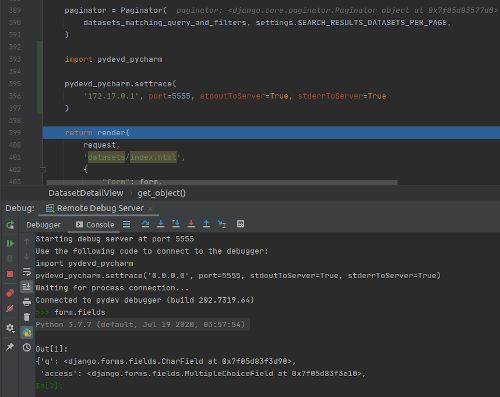

# Remote debugging docker containers

## PDB

As `ipdb` has some issues with gevent and monkey patching we are only able to debug using vanilla `pdb` currently.

To set this up locally.

1. Install remote-pdb-client `pip install remote-pdb-client` or just `pip install -r requirements-dev.txt` 
2. Ensure you have the following in `dev.env`
    - `PYTHONBREAKPOINT=remote_pdb.set_trace`
    - `REMOTE_PDB_HOST=0.0.0.0`
    - `REMOTE_PDB_PORT=4444`
3. Sprinkle some `breakpoint()`s liberally in your code
4. Bring up the docker containers ` docker-compose -f docker-compose-dev.yml up` 
5. Listen to remote pdb using `remotepdb_client --host localhost --port 4444`
6. Go and break things http://dataworkspace.test:8000

## Pycharm

To debug via the pycharm remote debugger you will need to jump through a few hoops.

1. Configure `docker-compose-dev.yml` as a remote interpreter.  
    

2. Configure a python debug server for `pydev-pycharm` to connect to. You will need to ensure the path mapping 
is set to the path of your dev environment.  
    

3. Bring up the containers  
    ` docker-compose -f docker-compose-dev.yml up`

4. Start the pycharm debugger  
    

5. Add a breakpoint using pydev-pycharm  
    

4. Profit  
    

## VSCode

Coming soon...
